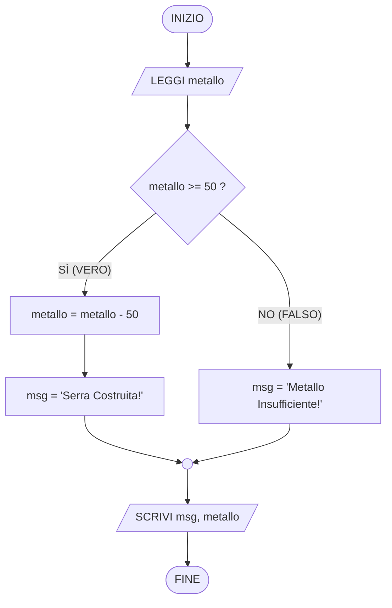

# Lezione 03: Le Condizioni e i Bivi nel City Builder Marziano
**Data:** 05 Ottobre 2026  
**Corso:** Programmazione 1 (Prima Superiore — Operatore Informatico, 80 Ore)  
**Docente:** Daniele Cerrina (`daniele.cerrina@immaginazioneelavoro.it`)  
**Sede:** Piazza dei Mestieri (Torino)  
**Progetto Guida Annuale:** **Mars City Builder (Lite)**

---

## 1. Perché un Gestionale ha Bisogno di Bivi Condizionali?

Nelle lezioni precedenti abbiamo visto la **struttura sequenziale**: una lista rigida di istruzioni eseguite una dietro l'altra, senza mai deviare.

Immaginiamo però di programmare il nostro **city builder su Marte** usando solo la sequenza pura:  
Il giocatore clicca sul pulsante *"Costruisci Cupola Idroponica"*. Se il codice non controlla prima il magazzino, piazzerà l'edificio sulla mappa anche se il giocatore ha $0$ metallo! Il bilancio scenderebbe a $-50$ metallo, rompendo la partita.

Un videogioco gestionale diventa funzionante solo quando sa **osservare lo stato delle risorse prima di agire**: questa struttura logica si chiama **SELEZIONE** (o bivio condizionale).


---

## 2. Cos'è una Condizione? La Logica Booleana

Una **condizione** è un'espressione matematica di confronto che ammette solo **DUE possibili risultati**:

$$\text{Condizione} \longrightarrow \begin{cases} \textbf{VERO} & (\text{True / 1}) \\ \textbf{FALSO} & (\text{False / 0}) \end{cases}$$

Non esistono vie di mezzo: o hai abbastanza crediti o non li hai; o la colonia produce abbastanza energia o non la produce. Questa logica binaria si chiama **Logica Booleana** (da George Boole).

* **Condizioni Booleane nel City Builder:**
  * `metallo >= 50` $\to$ Con metallo $= 70$ è **VERO**; con metallo $= 30$ è **FALSO**.
  * `energia_prodotta >= energia_richiesta` $\to$ Con $100 \ge 80$ è **VERO**; con $60 \ge 80$ è **FALSO**.
  * `coloni == 0` $\to$ Se i coloni sono 0 è **VERO** (Colonia Deserta); se sono 12 è **FALSO**.
* **Frasi NON Booleane (Vietate negli algoritmi):**
  * *"La colonia è bella?"* (Soggettivo: il computer non ha gusti).
  * *"Costruisci qualche casa"* (Vago: quante case esattamente?).

---

## 3. Gli Operatori Relazionali di Confronto

Per confrontare le risorse e i parametri della colonia usiamo i 6 operatori relazionali standard:

| Simbolo | Significato | Esempio nel Gestionale | Risultato con `crediti = 50` |
|:---:|:---|:---|:---:|
| `>` | Strettamente Maggiore | `crediti > 20` | **VERO** ($50 > 20$) |
| `<` | Strettamente Minore | `crediti < 10` | **FALSO** ($50 < 10$) |
| `>=` | Maggiore o Uguale | `crediti >= 50` | **VERO** ($50 \ge 50$) |
| `<=` | Minore o Uguale | `crediti <= 40` | **FALSO** ($50 \le 40$) |
| `==` | Uguale a (Confronto) | `crediti == 50` | **VERO** ($50$ è identico a $50$) |
| `!=` | Diverso da | `crediti != 50` | **FALSO** (sono uguali, non diversi) |

> [!WARNING]
> **La Trappola #1 dei Programmatori: `=` vs `==`**  
> * **`=` (Assegnazione):** è un ordine d'azione. Prende un valore e lo memorizza nella variabile (es. `crediti = 100` deposita 100 crediti nel conto).
> * **`==` (Confronto):** è una domanda. Chiede al computer se i due valori sono identici (es. `crediti == 100`). Restituisce `VERO` o `FALSO` senza toccare la memoria!

---

## 4. La Struttura `SE ... ALLORA ... ALTRIMENTI`

La selezione fondamentale divide il cammino del programma in due rami **mutuamente esclusivi**: o si esegue il primo o si esegue il secondo, mai entrambi nello stesso turno.

```text
SE <condizione booleana> ALLORA
    // Ramo VERO: eseguito se la condizione è VERA
    istruzione_A1
    istruzione_A2
ALTRIMENTI
    // Ramo FALSO: eseguito se la condizione è FALSA
    istruzione_B1
    istruzione_B2
FINE SE

// Il programma si ricongiunge qui per le istruzioni successive
```

### Variante: La Selezione a Una Via (Senza `ALTRIMENTI`)
Se in caso di esito `FALSO` non dobbiamo fare nessuna azione speciale (ad esempio un bonus di fine turno facoltativo):

```text
SE colonia_felice == VERO ALLORA
    crediti = crediti + 20
FINE SE
salva_partita()
```

---

## 5. Il Pattern Classico del City Builder: Verifica & Spesa

Ogni volta che il giocatore ordina una costruzione nel nostro gestionale, l'algoritmo applica sempre questa sequenza logica:

1. **Verifica Risorse:** controlla se le scorte in magazzino coprono il costo (`SE risorsa >= costo`).
2. **Aggiornamento Magazzino (se VERO):** piazza l'edificio e scala il costo dalle risorse (`risorsa = risorsa - costo`).
3. **Feedback a Schermo:** mostra un messaggio chiaro al giocatore (conferma di costruzione o notifica di risorse insufficienti).

---

## 6. Esempio Svolto dal Docente: Costruzione Cupola Idroponica

Nel nostro *Mars City Builder*, il giocatore vuole costruire una serra idroponica per produrre ortaggi per i coloni.


### Testo del Problema
Ogni Cupola Idroponica ha un costo fisso di **50 unità di metallo**.  
* L'algoritmo legge la quantità di `metallo_disponibile` nel magazzino centrale.
* Se il metallo è **pari o superiore a 50** (`metallo_disponibile >= 50`), il sistema scala 50 unità dal magazzino (`metallo_disponibile = metallo_disponibile - 50`) e imposta il messaggio su `"Serra costruita con successo!"`.
* Altrimenti, non costruisce nulla e imposta il messaggio su `"Metallo insufficiente per la Serra!"`.
* Alla fine, stampa il messaggio e il metallo rimasto in magazzino.

---

### Passo 1: Scomposizione nel Modello I-P-O

```
[ INPUT ]                 ------> [ ELABORAZIONE CONDIZIONALE ]  ------> [ OUTPUT ]
metallo_disponibile               SE metallo_disponibile >= 50:          messaggio
(numero intero >= 0)                metallo_disponibile = metallo - 50   metallo_disponibile
                                    messaggio = "Serra costruita..."     (saldo aggiornato)
                                  ALTRIMENTI:
                                    messaggio = "Metallo insufficiente..."
```

---

### Passo 2: Algoritmo Formale in Pseudocodice

```text
// 1. Acquisizione dato dal magazzino
LEGGI metallo_disponibile

// 2. Controllo di fattibilità e spesa
SE metallo_disponibile >= 50 ALLORA
    metallo_disponibile = metallo_disponibile - 50
    messaggio = "Serra costruita con successo!"
ALTRIMENTI
    messaggio = "Metallo insufficiente per la Serra!"
FINE SE

// 3. Notifica al giocatore
SCRIVI messaggio
SCRIVI "Metallo rimasto in magazzino: ", metallo_disponibile
```

---

### Passo 3: Il Flow Chart (Diagramma a Blocchi) della Serra

Prima di scrivere il codice o lo pseudocodice, visualizziamo la logica attraverso il diagramma a blocchi:



---

## 6. Guida alle Forme Geometriche del Flow Chart

Nei diagrammi a blocchi ogni figura geometrica ha un significato standard e universale:

| Forma Geometrica | Funzione Algoritmica | Istruzioni Corrispondenti | Esempio nel City Builder |
| :--- | :--- | :--- | :--- |
| **Parallelogramma** | **Input & Output** (ingresso dati da tastiera/sensori e stampa a video) | `LEGGI ...` / `SCRIVI ...` | `LEGGI metallo`, `SCRIVI stato` |
| **Rettangolo** | **Operazioni & Calcoli** (assegnazioni matematiche e modifiche di memoria) | Variabile `=` Valore / Calcolo | `metallo = metallo - 50` |
| **Rombo / Esagono** | **Condizione & Bivio** (decisione booleana con 2 uscite obbligatorie: SÌ e NO) | `SE ... ?` | `metallo >= 50 ?` |
| **Ovale / Ellisse** | **Inizio & Fine** (delimitano il flusso di esecuzione dall'inizio al termine) | `INIZIO` / `FINE` | Apertura e chiusura dell'algoritmo |

> [!IMPORTANT]
> **Le 3 Regole d'Oro del Flow Chart:**
> 1. **Frecce direzionali:** collegano i blocchi dall'alto verso il basso e non devono mai rimanere aperte.
> 2. **Etichette sul Rombo:** ogni rombo DEVE avere due frecce uscenti contrassegnate chiaramente con **SÌ** (o **VERO**) e **NO** (o **FALSO**).
> 3. **Punto di ricongiunzione:** i due rami alternativi del rombo devono sempre riunirsi prima del blocco di output finale e di `FINE`.

---

## 7. Esercizi di Laboratorio su Carta: Solo Algoritmi (Flow Chart)

Modalità: **individuale o a coppie**, sul quaderno di informatica (usando penna e righello).  
Per ciascun esercizio devi disegnare il **Flow Chart completo**, rispettando le forme geometriche standard (parallelogrammi per I/O, rettangoli per operazioni, rombi per le scelte).

---

### Esercizio 1: Il Bilancio Energetico della Colonia

**La Situazione nella Colonia:**  
> *Il sole rosso di Marte sta calando dietro i crateri di Tharsis. Nella sala di controllo suonano i primi monitor: i coloni rientrano nelle cupole, accendono i riscaldatori termici e i purificatori d'aria passano alla modalità notturna. Come responsabile dell'energia, devi verificare se la carica accumulata dai pannelli solari basterà per tutta la notte o se la colonia rischia un blackout gelido a causa dell'alto consumo degli edifici.*


**Cosa deve gestire il gioco:**  
* Se l'energia prodotta riesce a coprire o superare il fabbisogno richiesto dalla base, la rete elettrica è stabile e la colonia trascorre la notte in piena sicurezza.
* Se invece la produzione è insufficiente a soddisfare la richiesta, scatta l'allarme blackout: bisogna allertare immediatamente la colonia ordinando il distacco dei macchinari e delle fabbriche.
* Il programma deve visualizzare a schermo il messaggio sullo stato della rete.

**La tua consegna:**  
Disegna il Flow Chart completo (Inizio &rarr; Input con parallelogramma &rarr; Bivio con rombo SÌ/NO &rarr; Assegnazioni in rettangoli &rarr; Ricongiunzione &rarr; Output con parallelogramma &rarr; Fine).

---

### Esercizio 2: Arrivo di Nuovi Coloni e Razioni di Cibo

**La Situazione nella Colonia:**  
> *I retrorazzi della navetta "Ares Shuttle" sollevano una nube di polvere rossa sulla pista n° 2: sono sbarcati nuovi coloni appena arrivati dalla Terra. Prima di aprire i portelloni pressurizzati e dare loro il benvenuto, l'amministratore della base deve consultare il terminale dei silos idroponici, sapendo che ciascun colono consuma esattamente una cassa di cibo a turno.*


**Cosa deve gestire il gioco:**  
* Se nel magazzino ci sono abbastanza provviste per sfamare tutti i coloni presenti (le casse di cibo bastano o avanzano), il cibo viene distribuito all'intera popolazione, le scorte nel silos diminuiscono della quantità consumata e i coloni sono sazi.
* Se invece le scorte non sono sufficienti per tutti, la distribuzione non deve avvenire per evitare tensioni e disordini, e scatta l'allarme carestia.
* Il programma deve visualizzare l'esito della distribuzione e mostrare il saldo finale delle scorte rimaste nel silos.

**La tua consegna:**  
Disegna il Flow Chart completo (Inizio &rarr; Input scorte e coloni con parallelogramma &rarr; Bivio con rombo SÌ/NO &rarr; Ramo SÌ con rettangolo di sottrazione scorte &rarr; Ricongiunzione &rarr; Output saldo &rarr; Fine).

---

### Esercizio 3: L'Indice di Felicità della Colonia (Meccanica Eventi)

**La Situazione nella Colonia:**  
> *È venerdì sera nella cupola centrale e si tiene l'assemblea cittadina. Vivere a 200 milioni di chilometri dalla Terra, mangiando solo soia idroponica e affrontando tempeste di sabbia, mette a dura prova i nervi degli abitanti. I sensori sociali della colonia registrano costantemente l'indice di gradimento della popolazione (con un punteggio che varia da 0 a 100).*


**I Tre Scenari da Riconoscere:**  
1. **Colonia Fiorente:** se il gradimento raggiunge o supera i 75 punti, la cittadinanza è entusiasta; la produttività sale e la colonia incassa un bonus speciale di 50 crediti.
2. **Rivolta:** se il gradimento scende sotto i 40 punti, il malcontento sfocia in uno sciopero generale e le attività produttive vengono bloccate.
3. **Colonia Stabile:** in tutti i casi intermedi (gradimento compreso tra 40 e 74), la vita prosegue regolarmente senza bonus né blocchi.
* Il programma deve valutare l'indice inserito e comunicare a schermo lo stato finale della comunità marziana.

**La tua consegna:**  
Disegna il Flow Chart a cascata: usa due rombi collegati sul ramo NO per gestire elegantemente i tre scenari!

---

## 8. Soluzioni per il Docente

### Soluzione Esercizio 1 (Bilancio Energetico)
* **Blocchi Flow Chart:**
  1. `[INIZIO]` (Ovale)
  2. `[/LEGGI energia_prodotta, energia_richiesta/]` (Parallelogramma)
  3. `{energia_prodotta >= energia_richiesta ?}` (Rombo)
     - **SÌ:** `[stato_rete = "RETE STABILE: Energia sufficiente"]` (Rettangolo)
     - **NO:** `[stato_rete = "BLACKOUT: Energia insufficiente, disconnetti fabbriche!"]` (Rettangolo)
  4. Ricongiunzione rami &rarr; `[/SCRIVI stato_rete/]` (Parallelogramma) &rarr; `[FINE]` (Ovale)

```text
LEGGI energia_prodotta
LEGGI energia_richiesta

SE energia_prodotta >= energia_richiesta ALLORA
    stato_rete = "RETE STABILE: Energia sufficiente"
ALTRIMENTI
    stato_rete = "BLACKOUT: Energia insufficiente, disconnetti fabbriche!"
FINE SE

SCRIVI stato_rete
```

---

### Soluzione Esercizio 2 (Nuovi Coloni e Cibo)
* **Blocchi Flow Chart:**
  1. `[INIZIO]` (Ovale)
  2. `[/LEGGI scorte_cibo, numero_coloni/]` (Parallelogramma)
  3. `{scorte_cibo >= numero_coloni ?}` (Rombo)
     - **SÌ:** `[scorte_cibo = scorte_cibo - numero_coloni]` &rarr; `[esito = "Cibo distribuito: coloni sazi!"]` (Rettangoli)
     - **NO:** `[esito = "CARESTIA: Scorte di cibo insufficienti nella colonia!"]` (Rettangolo)
  4. Ricongiunzione rami &rarr; `[/SCRIVI esito, scorte_cibo/]` (Parallelogramma) &rarr; `[FINE]` (Ovale)

```text
LEGGI scorte_cibo
LEGGI numero_coloni

SE scorte_cibo >= numero_coloni ALLORA
    scorte_cibo = scorte_cibo - numero_coloni
    esito = "Cibo distribuito: coloni sazi!"
ALTRIMENTI
    esito = "CARESTIA: Scorte di cibo insufficienti nella colonia!"
FINE SE

SCRIVI esito
SCRIVI "Scorte di cibo rimaste nel silos: ", scorte_cibo
```

---

### Soluzione Esercizio 3 (Felicità a 3 Scenari)
* **Blocchi Flow Chart:**
  1. `[INIZIO]` (Ovale) &rarr; `[/LEGGI felicita/]` (Parallelogramma)
  2. `{felicita >= 75 ?}` (Rombo 1)
     - **SÌ:** `[stato = "COLONIA FIORENTE (+50 Crediti)"]` (Rettangolo)
     - **NO:** `{felicita < 40 ?}` (Rombo 2)
       - **SÌ:** `[stato = "RIVOLTA: Produzione bloccata!"]` (Rettangolo)
       - **NO:** `[stato = "COLONIA STABILE: Regolare"]` (Rettangolo)
  3. Convergenza di tutti i rami &rarr; `[/SCRIVI stato/]` (Parallelogramma) &rarr; `[FINE]` (Ovale)

```text
LEGGI felicita

SE felicita >= 75 ALLORA
    stato = "COLONIA FIORENTE (+50 Crediti di Bonus Tasse!)"
ALTRIMENTI
    SE felicita < 40 ALLORA
        stato = "RIVOLTA: Coloni in sciopero, produzione bloccata!"
    ALTRIMENTI
        stato = "COLONIA STABILE: Situazione regolare"
    FINE SE
FINE SE

SCRIVI stato
```

---

## 9. Checklist di Controllo del Flow Chart

Prima di considerare concluso il disegno sul quaderno, controlla insieme al tuo compagno di banco:
- [ ] Abbiamo usato i **parallelogrammi** per ogni operazione di INPUT (`LEGGI`) e OUTPUT (`SCRIVI`)?
- [ ] Abbiamo usato i **rettangoli** per i calcoli e le assegnazioni con `=`?
- [ ] Abbiamo usato i **rombi (o esagoni)** per le condizioni, scrivendo sempre le etichette **SÌ** (o **VERO**) e **NO** (o **FALSO**) su ciascuna freccia uscente?
- [ ] Entrambi i rami alternativi di ogni bivio si **ricongiungono** con le frecce prima di arrivare all'output finale e al blocco **FINE**?
- [ ] Il diagramma ha un unico punto di **INIZIO** e un unico punto di **FINE** (ovali)?
